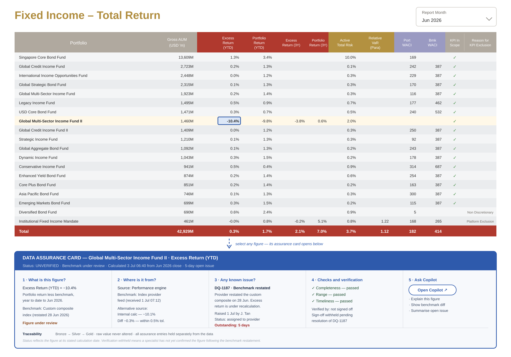

# IMM Dashboard

A synthetic investment-mandate monitoring panel and a static dashboard that reads it.

The dataset is generated from a specification — no real portfolio data is involved.
The dashboard reproduces the layout in `reference/dashboard-screenshot.png` and is
driven entirely by a JSON config file.



## Quick start

```bash
python3.11 -m http.server 8321
```

Open <http://localhost:8321/dashboard/>. Nothing needs building — **the page reads
`data/imm_data.xlsx` directly in the browser**, so editing the workbook and
refreshing is enough.

To regenerate the data itself:

```bash
.venv/bin/python generate_imm_data.py     # -> data/imm_data.xlsx
```

### Pointing at a different workbook

Set `dataset.workbook` in the config, or override per-visit from the URL:

```
http://localhost:8321/dashboard/?data=../data/other.xlsx&sheet=data
```

The path is resolved relative to `index.html`, and the workbook must be reachable
over http from the page — which is why the server runs from the project root.

## Layout

```
generate_imm_data.py          panel generator (spec -> xlsx)
build_dashboard.py            optional JSON dump of the workbook (not used by the page)
data/imm_data.xlsx            360 rows x 44 columns
dashboard/index.html          the page (self-contained CSS + JS)
dashboard/config/settings.json  everything configurable
reference/                    the layout this is modelled on
claude.md                     data specification + guidance for Claude Code
```

## The data

330 mandates was the original spec; the shipped workbook carries **12 teams x 10
mandates x 3 month-ends** (31 May, 30 Jun, 31 Jul 2026) = 360 rows.

It is a genuine panel, not three independent samples. Static fields (name, team,
entity, fund ORR, KPI scope) are constant across a mandate's three rows; time-varying
fields evolve with month-to-month persistence via a **Gaussian-copula AR(1)** — the
persistence is applied to a latent normal series which is then pushed through each
field's truncated-normal quantile function, so every field still matches its specified
marginal distribution exactly at every report date. Month-over-month correlation runs
0.90 (YTD returns) to 0.98 (AUM, 3-year returns).

Generation is seeded (`--seed 42`) and reproducible. Column distributions are defined in
[claude.md](claude.md).

> **These are synthetic numbers with known artefacts.** `excess_rtn_*` does not
> reconcile to portfolio minus benchmark, heavily truncated fields do not reproduce
> their stated mean and standard deviation, `aum_usd` can be negative, and
> `port_total_risk` renders far larger than the reference screenshot suggests. See
> *Known data caveats* in [claude.md](claude.md).

## Configuring the dashboard

Everything lives in [`dashboard/config/settings.json`](dashboard/config/settings.json).
Edit it and refresh the browser — there is nothing to rebuild. The file carries its own
`_readme` block; this is the summary.

### Columns

Each entry maps one workbook column onto the dashboard, reading left to right:

```json
{ "column": "excess_rtn_ytd", "analytics": "perf", "header": "Excess|Return|(YTD)", "format": "pct1" }
```

| Field | Meaning |
|---|---|
| `column` | the column name in `imm_data.xlsx` — supplies the values |
| `analytics` | which analytics group it belongs to; **this sets the header colour** |
| `header` | the label shown on the dashboard (`\|` starts a new header line) |
| `format` | `text`, `musd`, `pct1`, `num2`, `int`, `tick` |

Array order is display order. Delete a line to drop a column; move a line to move it.
All 44 workbook columns are available, not just the ones currently listed.

Optional per column: `width`, `align`, `total` (`sum`/`avg`/`wavg`/`none`), and
`showWhen` — e.g. `"showWhen": {"kpi_in_scope": 0}` renders the exclusion reason only
for mandates that are actually excluded. Anything omitted is derived from `format`.

### Analytics groups

Header colours are set per analytics group, so related columns read as a block:

```json
"analytics": {
  "perf": { "label": "Performance", "colour": "#B0392E" },
  "risk": { "label": "Risk",        "colour": "#B39140" }
}
```

Add your own groups freely. `base` is the identity block and is always shown.

### Teams

`groups` is the Team picker, in order. Any entry may override the two blocks
above it — for that group only:

```json
{ "group": "4. ILP",
  "title": "Investment-Linked Products",
  "columns": ["port_mandate_name", "aum_usd", "peer_rank_1y"],
  "analytics": { "esg": false, "risk": { "colour": "#7A6BA8" } } }
```

A group's `columns` list wins over analytics show/hide, and may only name columns
already defined in the top-level `columns`. A group with no overrides shows the full list.

### Table behaviour

```json
"table": {
  "aggregation": "wavg",
  "defaultSort": [
    { "column": "kpi_in_scope", "direction": "desc" },
    { "column": "aum_usd",      "direction": "desc" }
  ],
  "pageSize": 10,
  "pageSizeOptions": [5, 10, 25, 50, 100, "all"]
}
```

`aggregation` is `wavg` (weighted by `dataset.weightColumn`, i.e. AUM) or `avg` (plain
mean); a column's own `total` still wins, and `musd` columns always sum.

## Using the dashboard

- **Sort** — click a header to sort by that column; click again to flip. **Shift-click**
  adds a further sort key (▼ → ▲ → removed); a small number on the arrow shows priority.
  Blanks always sort last.
- **Paginate** — the rows-per-page select and pager sit directly under the table. The
  **Total row always covers the whole selection**, not just the visible page.
- **Inspect** — click any numeric cell to highlight it and its row.

## Requirements

Python 3.11+ with `numpy`, `pandas` and `openpyxl`. A `.venv` is already set up; to
build one from scratch:

```bash
python3.11 -m venv .venv
.venv/bin/pip install -r requirements.txt
```

Only the two generators need these. **Serving the dashboard needs no third-party
packages** — it is a static page served by the standard library.

Two environment notes specific to this machine: use `/usr/local/bin/python3.11`, since
the system `python3` is a broken 3.7; and do not import `scipy` — its first load stalls
for minutes under macOS Gatekeeper, which is why the generator builds its
truncated-normal quantile from `math.erf` and `statistics.NormalDist` instead.

After editing `index.html`, hard-reload (⇧⌘R) — the page itself is browser-cached even
though `data.js` and `settings.json` are not.
